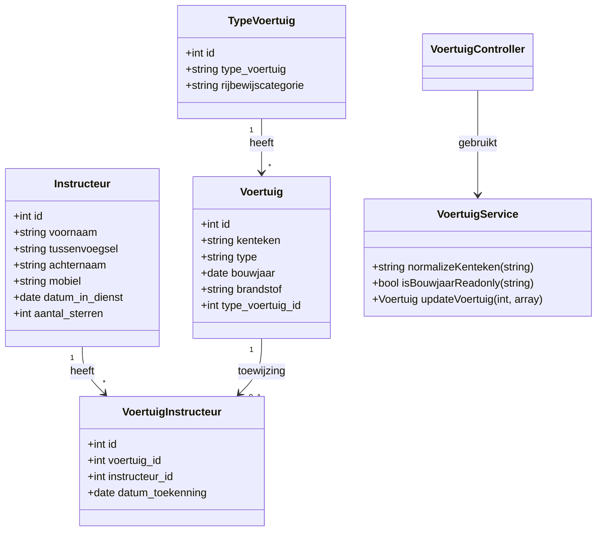

# Class Diagram (Mermaid)

```mermaid
classDiagram
    class Instructeur {
        +int id
        +string voornaam
        +string tussenvoegsel
        +string achternaam
        +string mobiel
        +date datum_in_dienst
        +int aantal_sterren
    }

    class TypeVoertuig {
        +int id
        +string type_voertuig
        +string rijbewijscategorie
    }

    class Voertuig {
        +int id
        +string kenteken
        +string type
        +date bouwjaar
        +string brandstof
        +int type_voertuig_id
    }

    class VoertuigInstructeur {
        +int id
        +int voertuig_id
        +int instructeur_id
        +date datum_toekenning
    }

    class VoertuigService {
        +string normalizeKenteken(string)
        +bool isBouwjaarReadonly(string)
        +Voertuig updateVoertuig(int, array)
    }

    TypeVoertuig "1" --> "*" Voertuig : heeft
    Instructeur "1" --> "*" VoertuigInstructeur : heeft
    Voertuig "1" --> "0..1" VoertuigInstructeur : toewijzing
    VoertuigController --> VoertuigService : gebruikt
```
