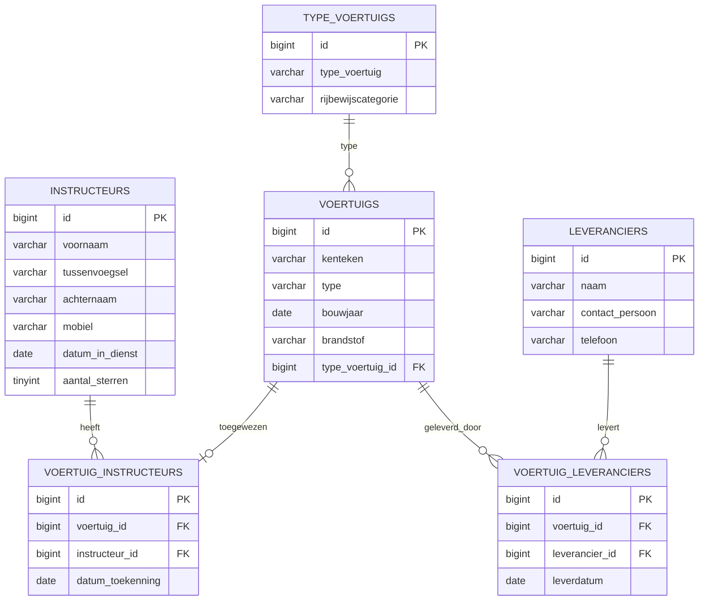

# ERD (Mermaid)

```mermaid
erDiagram
    INSTRUCTEURS ||--o{ VOERTUIG_INSTRUCTEURS : heeft
    VOERTUIGS ||--o| VOERTUIG_INSTRUCTEURS : toegewezen
    TYPE_VOERTUIGS ||--o{ VOERTUIGS : type
    LEVERANCIERS ||--o{ VOERTUIG_LEVERANCIERS : levert
    VOERTUIGS ||--o{ VOERTUIG_LEVERANCIERS : geleverd_door

    INSTRUCTEURS {
      bigint id PK
      varchar voornaam
      varchar tussenvoegsel
      varchar achternaam
      varchar mobiel
      date datum_in_dienst
      tinyint aantal_sterren
    }

    TYPE_VOERTUIGS {
      bigint id PK
      varchar type_voertuig
      varchar rijbewijscategorie
    }

    VOERTUIGS {
      bigint id PK
      varchar kenteken
      varchar type
      date bouwjaar
      varchar brandstof
      bigint type_voertuig_id FK
    }

    VOERTUIG_INSTRUCTEURS {
      bigint id PK
      bigint voertuig_id FK
      bigint instructeur_id FK
      date datum_toekenning
    }

    LEVERANCIERS {
      bigint id PK
      varchar naam
      varchar contact_persoon
      varchar telefoon
    }

    VOERTUIG_LEVERANCIERS {
      bigint id PK
      bigint voertuig_id FK
      bigint leverancier_id FK
      date leverdatum
    }
```
